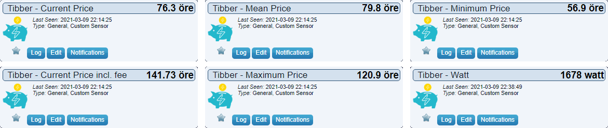

Important, you must Allow new devices, in Domoticz, Setup-Settings-System-Hardware/Devices.

Create a folder with a name that you like in "domoticz/plugins"  
Put plugin.py, tibber.zip, requirements.txt in that folder  

or

In domoticz/plugins run command "sudo git clone https://github.com/flopp999/Tibber-Domoticz.git"

-------------------

Run "sudo pip3 install -r requirements.txt" to install all packages that this plugin needs  
Restart Domoticz  
Add Tibber from Hardware  
Input your Token and HomeID, get it by log in to this page https://developer.tibber.com/explorer  
Load personal token and paste below code click PLAY
```
{
  viewer {
    homes {
      id
    }
  }
}
```




Support me with a coffee https://www.buymeacoffee.com/flopp999
